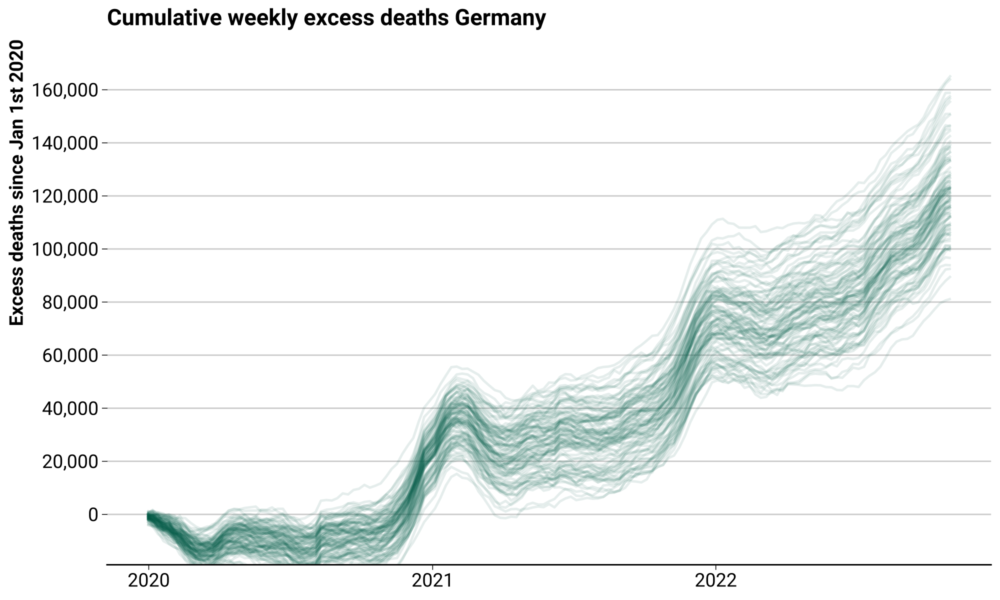

# Predictive Modeling

Jonas Schöley

Materials related to the PHDS22 seminar on "Predictive Modeling".

In population health prediction takes many forms: we may be interested in the future development of fertility, the future care home demand, the infant mortality in regions of the world without reliable data collection. We may ask “what-if” questions that require prediction for a scenario that never happened: How many deaths without COVID-19? How many deaths without the summer heat wave? These questions are concerned with the prediction of an outcome. The focus is on the left-hand side of the regression equation, not on the interpretation of coefficients. In this seminar I will demonstrate the predictive modeling workflow: formulation of a prediction model, out-of-sample model validation, and simulation-based uncertainty quantification and propagation. We will discuss a range of applications for predictive modeling within the context of population health.

